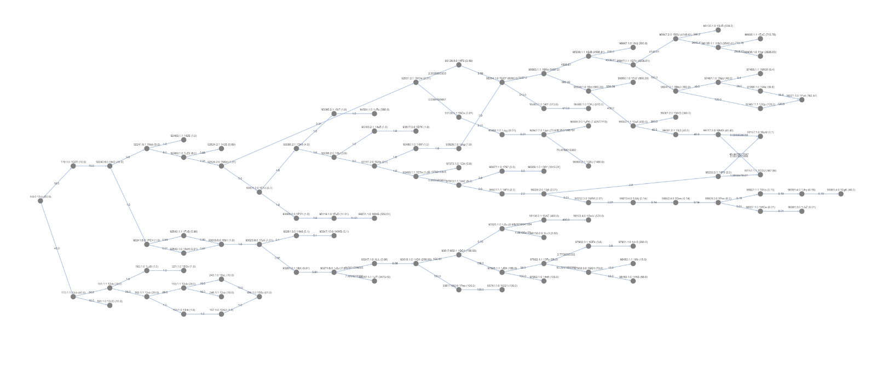

# Bitcoin Data Graph

As part of my senior research project at VIU, I developed a graph representation of the Bitcoin blockchain data. This graph representation is intended to be used for tracing Bitcoin transactions and for developing algorithms to achieve it.

It is fascinating to analyze the complex transactions on the Bitcoin blockchain. Since all transaction data is public, it is possible to trace the flow of Bitcoin from its creation to its current location. This is not a completely straightforward task, as it involves a bit of estimation and guesswork, but it allows for telling the source and destination of specific Bitcoins with some degree of certainty.

Some visualizations of Bitcoin transactions are shown below. The first is the transaction history graph stemming from the second output of the 4th transaction on block 546, from address `1KAD5EnzzLtrSo2Da2G4zzD7uZrjk8zRAv`. The second shows all of the transactions going forward which stem from the block 9 coinbase output by address `12cbQLTFMXRnSzktFkuoG3eHoMeFtpTu3S`.




# Project Description

The main point of this project is to effectively demonstrate Bitcoin tracing in a graph database, and to develop algorithms to achieve it.

## Main Challenges in Tracing
The main challanges when attempting to trace Bitcoin transaction histories are:
- The massive scale of the Bitcoin blockchain dataset and the transactions therein,
- The complexity of the Bitcoin transaction data model, and
- the presence of "bad data", such as duplicate transactions.

## Complexity of the Bitcoin Data Model
To go into more detail about the complexity of the Bitcoin transaction data model, we need only examine some real transactions. There exist transactions where individuals send coin directly to themselves, ones where they send coin back and forth between themselves and other addresses multiple times, and ones where hundreds of addresses send coin to hundreds of other addresses in the same transaction.

Because of the way the Bitcoin core protocol works, all of the addresses used to send coin in one transaction are presumably owned and controlled by one individual or entity.

### Duplicate Transactions
There are two occurrences of duplicate transactions on the Bitcoin Blockchain. On block 91,842, a transaction exists that has the same hash as a previous one. And on 91,880, a similar case occurred. This issue was fixed in BIP-30, so the issue will no longer occur. But despite this, we must still handle this corner case.

When a transaction is duplicated, the nature of the Bitcoin core software ensues that only the newest transaction is spendable. For this reason, it makes sense that the graph representations of Bitcoin transaction data only consider the newest one.

## Graph Representations

### Address Proportion Graph
In this graph representation, each node is an address, and each edge is a haircut proportion between two output nodes. Two addresses will be connected based on the addresses present in these output nodes. The sender will have an edge directed at the recipient.

Due to the difficulty of tracing this data model, including the possibility for cycles between addresses, this approach was not selected for this project.

### Output Proportion Graph
In this graph representation, each node is an output, and each edge is a haircut proportion between two output nodes.

Tracing this graph is straightforward, simply involving a backtracking depth-first traversal from a given node backwards to all of its senders. Since the graph only goes forwards, and thus contains no cycles, we only need to concern ourselves with looking backwards.

Due to its simplicity, and the ease of developing algorithms, this approach was selected for this project.


# Usage
This project utilizes Docker and Docker Compose to manage its environment. A Makefile is provided to simplify the process of building, running, and managing the application.

## Prerequisites

Before you begin, ensure you have installed:

- Docker
- Docker Compose
- Make

## Getting Started

To get started with the project, first clone the repository and navigate into the project directory.

Copy the `.env.example` file to `.env` and modify the environment variables as specified.

## Using the Makefile

The Makefile includes several commands to manage the Docker containers, networks, and volumes associated with the project.

### Starting the Application

To start the application, run the following command:

```bash
make start
```

This command starts all defined services in the background (`-d` option). If any service fails to start, the command will exit with an error message.

### Populating Data

The project supports populating data into the database. You can populate blocks and graph data using the following commands:

- To populate blocks up to a default height:

```bash
make populate_blockchain
```

- To populate blocks up to a specific height (e.g., height 200):

```bash
make populate_blocks BLOCK_HEIGHT=200
```

- To populate the graph with data from the blockchain database:

```bash
make populate_graph
```

Now that everything is setup, try running the cells in `graph_tests.ipynb` to see the graph database in action.

### Running Tests

To run tests in the application:

```bash
make test
```

### Stopping the Application

To stop the running Docker containers:

```bash
make stop
```

### Cleaning Up

To remove Docker containers and networks created by `make run`:

```bash
make clean
```

For a full cleanup, including removal of volumes, images, and orphan containers:

```bash
make full_clean
```

## Additional Commands

- To view the status of the containers:

```bash
make ps
```

## Troubleshooting

The Janusgraph container often fails to start for unknown reasons, likely due to a bug in Janusgraph. If this occurs, try completely removing the container, building it, and starting it again:

```bash
$ docker-compose down btc_janus
$ docker-compose up --build -d btc_janus
```

# Using Janusgraph Console
### Start Janusgraph
```bash
# Start all containers
make start
```

### Go into container

```bash
# Go into container
docker-compose exec janusgraph bash
```

### Start Gremlin Console
```bash
# Start Gremlin Console
./bin/gremlin.sh
```

### Connect to Janusgraph
```bash
# Connect to Janusgraph
:remote connect tinkerpop.server conf/remote.yaml
:remote console
mgmt = graph.openManagement()
```